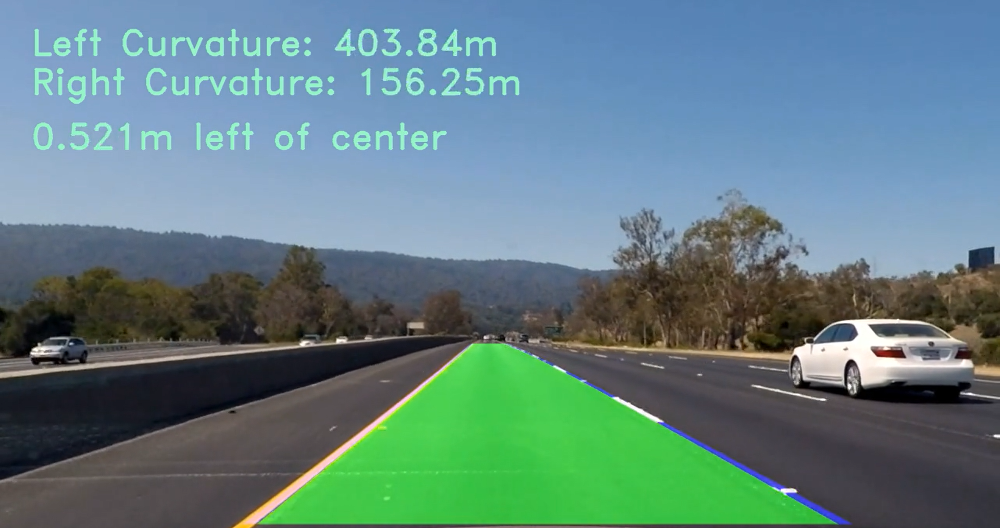

## Advanced Lane Finding

In this project, our goal is to write a software pipeline to identify the lane boundaries in a video.

Pipeline
---
My pipeline mainly consist of following functionalities which are distributed across different classes

* Camera Calibration
First we need to do camera calibration with known images which has object whose physical geometry is known to us.  
Camera calibration gives us Calibration matrix and distiortion coefficients which are used later to remove the distortion in an image

* Start with image or frame from video clip

* Correct Distortion  
Distortion is corrected using the calibration matrix found in above step along with distortion coefficients. 

* Color and Gradient Thresholding  
To find the lane lines correctly, we first need to understand what characteristics of an image can be used to correctly
extract lane lines. Here, I have used HSV color space, since yellow lines are clearly visible in S channel. The extracted S  
channel image is then thresholded with predefined threshold values to get binary image. For the computation of x and y gradients  
I used the L channel from the input image. I have used Sobel operator with Kernel size of 3 to get the gradients. 
To threshold the gradient image I have come up with a function that automatically calculates lower and higher thresholds for magnitude  
instead of using predefined fix values. The function takes the histogram of magnitude of gradients and finds thresholds. At the end  
gradient direction threshold is applied to get lines which have required orientation.  
At the end both color and gradient binaries are combined to get final thresholded binary image. 

