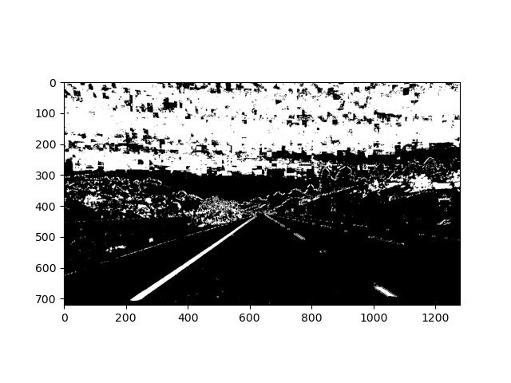

## Advanced Lane Finding

In this project, our goal is to write a software pipeline to identify the lane boundaries in a video.

Pipeline
---
My pipeline mainly consist of following functionalities which are distributed across different classes

* Camera Calibration
First we need to do camera calibration with known images which has object whose physical geometry is known to us.  
Camera calibration gives us Calibration matrix and distiortion coefficients which are used later to remove the distortion in an image

* Start with image or frame from video clip

* Correct Distortion  
Distortion is corrected using the calibration matrix found in above step along with distortion coefficients. 

* Color and Gradient Thresholding  
To find the lane lines correctly, we first need to understand what characteristics of an image can be used to correctly
extract lane lines. Here, I have used HSV color space, since yellow lines are clearly visible in S channel. The extracted S  
channel image is then thresholded with predefined threshold values to get binary image. For the computation of x and y gradients  
I used the L channel from the input image. I have used Sobel operator with Kernel size of 3 to get the gradients. 
To threshold the gradient image I have come up with a function that automatically calculates lower and higher thresholds for magnitude  
instead of using predefined fix values. The function takes the histogram of magnitude of gradients and finds thresholds. At the end  
gradient direction threshold is applied to get lines which have required orientation.  
At the end both color and gradient binaries are combined to get final thresholded binary image. 

* Perspective Transform  
Binary threholded image is then warped to get the bird's eye view which makes us to see the lane lines correctly. If lane lines  
are parallel in the scene then they remain parallel after applying perspective transform. For the perspective transform we need to  
select four source points as a trapezoid to map to the corresponding points in the destination image. I have manually found the source and
destinations points by trial and error method. These points are then used to get the trasformation matrices to do warping and de-warping. 

* Finding Lane Lines  
Here comes the most tedius part of the project. The warped binary image is used for finding the lane lines. First I get rid of the area  
of image which I don't need for finding lanes lines. I then take the histogram of bottom half of the image. Peaks in the histogram give  
me the starting point for the left and right lane lines. A sliding window search is then performed to find all pixels which belong to lane  
lines. I then fit the polynomial on the lane lines pixels I have found. This operation is performed only on the first image. For the subsequent  
frames I serach for lanes pixels around already found lane lines. This makes the algorithm more efficient. Once the polynomial is fit, an interpolation
is used to cover all the points between two lane lines. 

* Calcualte Radius of Curvature and Center Distance  
Furthermore, the radius of curvature for both the lane lines is calcualted along with the center distance. Pixel to meter ratios are   
used to get the real world radius of curvature. 

* Final Output  
Finally, I unwarped the image and then a final weighted image is created with overlays drawn on it along with the texts for radius  
of curvature and center distance. 

Outcome
---
The proposed solution works best with test images and project video. Needless to say that it failed miserably on challenge video.  
One potential shortcoming with this approch is, the algorithm does not work well when there are many shadows on the road and lanes lines are faded.  
It also doesn't work well when there are false edges on the roads such as those created due to construction. 

Possible Improvement
---
There is a much scope to improve this algorithm. First thing would be to investigate other color spaces which do good job on specific types of lane  
lines. Secondly, the algorithm needs to have a mechanism to automatically switch to different color spaces based upon some detection. 
And last but not the least,for the source points which are needed for perspective transform are currently hard coded, I have tried some feature detectors  
like Harris Corner Detector and SURF to get those points during run time and we won't need to hard code them. But, it did not work as I expected.
It needs further investigation. 

The result can be seen in this [Video](https://github.com/akashchavan15/CarND-Advanced-Lane-Lines/blob/master/output_images/project_video.mp4)
